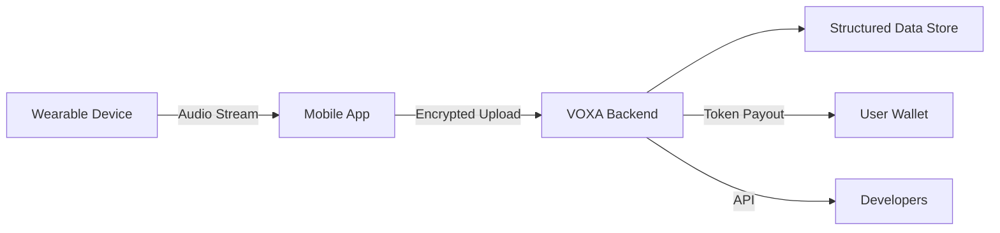

# VOXA 🚀

[](https://voxa.vc)  
[](LICENSE)

A platform that turns the world's conversations into structured data for smarter AI.

---

> **Vision:** Turning the world's conversations into data.

---

## 📋 Table of Contents

- [Overview](#overview)
- [Problem](#problem)
- [Solution](#solution)
- [Features](#features)
- [Architecture](#architecture)
- [Getting Started](#getting-started)
  - [Prerequisites](#prerequisites)
  - [Installation](#installation)
  - [Configuration](#configuration)
- [Usage](#usage)
- [Contributing](#contributing)
- [License](#license)

---

## 📝 Overview

VOXA pairs a wearable voice-capture device with a mobile app to transform everyday conversations into rich, structured data. This unlocks powerful AI-driven services like:

- **Automatic task management**
- **Real-time meeting summaries**
- **Personalized health insights**

Underrepresented languages and heavy accents can monetize their voice data by licensing to AI firms, fostering diversity in speech AI.

 <!-- placeholder: replace with your image -->

---

## ❓ Problem

- 98% of the world’s ~7,000 languages are unsupported by voice AI.
- Accent and dialect variation still cause poor accuracy in major languages.
- Lack of diverse, real-world voice data hinders natural AI conversation.

---

## 💡 Solution

VOXA combines a public-good ethos (à la Mozilla Common Voice) with DePIN-style token incentives to rapidly collect high-quality, globally diverse voice data.

---

## ✨ Features

- **Wearable recorder**: Discreet, on-the-go voice capture  
- **Mobile app**: Secure upload, transcription, and data labeling  
- **Incentive tokens**: Earn for every validated upload  
- **Developer API**: Access structured voice streams for model training  

---

## 🏗️ Architecture



---

## 🚀 Getting Started

### Prerequisites

- Node.js >= 14.x  
- Yarn or npm  
- Android/iOS device for testing  

### Installation

1. **Clone the repo**
   ```bash
   git clone https://github.com/your-org/voxa.git
   cd voxa
   ```
2. **Install dependencies**
   ```bash
   yarn install
   # or
   npm install
   ```

### Configuration

Copy the example env file and update:
```bash
cp .env.example .env
# Edit .env with your API keys and settings
```

---

## ▶️ Usage

- **Start backend**:
  ```bash
  yarn start:api
  ```
- **Run mobile app**:
  ```bash
  yarn start:app
  ```

Refer to the [docs](docs/) for detailed guides.

---

## 🤝 Contributing

1. Fork the repo  
2. Create a feature branch (`git checkout -b feature/foo`)  
3. Commit your changes (`git commit -m 'feat: add foo'`)  
4. Push to the branch (`git push origin feature/foo`)  
5. Open a Pull Request  

Please read our [CONTRIBUTING.md](CONTRIBUTING.md) for more details.

---

## 📄 License

This project is licensed under the MIT License - see the [LICENSE](LICENSE) file for details.
